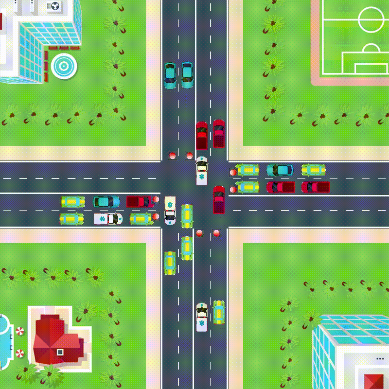

# Intersection Simulator
It is a second semester project for the programming classes at Poznań University of Technology.
I had a lot of features ideas for this project, but only some of them was realized due to limited amount of time. 

## About
The source code is in **src** folder, graphics in **content** the rest of files is configuration for VScode and SFML from [andrew r king](https://github.com/andrew-r-king/sfml-vscode-boilerplate).
### Application features:
- **simple 2D top-view graphical simulation of intersection, vehicles etc.**\
	cars turning (left and right) is not perfect: turning animation is far from real, when turning left vehicles from opposite directories are colliding
-	**creating own intersection**\
user can adjust number and types of lanes, but due to bad features planning the opposite directions must have the same amount and types of lanes\
there is pavement, but pedestrians and zebra crossings are not implemented
-	**editing amount vehicles on lanes**\
              there is option to choose a time between cars spawn for every direction
-	**intersection has one controlling mode named *smart***\
             it creates group of lanes and decides which is the most crowded, this group gets green light\
-	 *menu is very simple and the GUI is unfinished*
### Class and it’s tasks:
-	*Vehicles:* vehicles moving and appearance, lights reacting and collisions
-	*Lanes:* lanes appearing and appearance, spawning vehicles
-	*Intersection:* merging all element and controlling intersection flow

<i> Technologies used: C++, SFML library <i>
	

